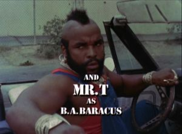

# baracus

* [Installation](#installation)
* [About](#about)
* [Examples](#examples)
* [Data Types](#data-types)
* [API Documentation](#api-documentation)
* [License](#license)

Utilities for working with byte arrays in Clojure & Clojurescript

## Installation
Using Leiningen / Clojars:

# About
Baracus provides various utilities for working with byte arrays in
Clojure & Clojurescript.

## Project Name
This project works with `byte-array` data, which is often abbreviated
`ba` in code. [B.A. Baracus](https://en.wikipedia.org/wiki/B._A._Baracus)
was a character on the 1980s TV series
[The A-Team](https://en.wikipedia.org/wiki/The_A-Team).

# Examples

# Data Types

# API Documentation

## License

Distributed under the Apache Software License, Version 2.0
http://www.apache.org/licenses/LICENSE-2.0.txt

Copyright (c) 2017-2019 Deer Creek Labs, LLC
